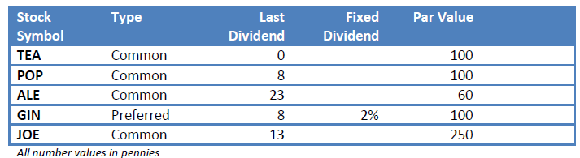
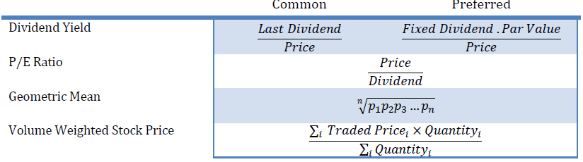
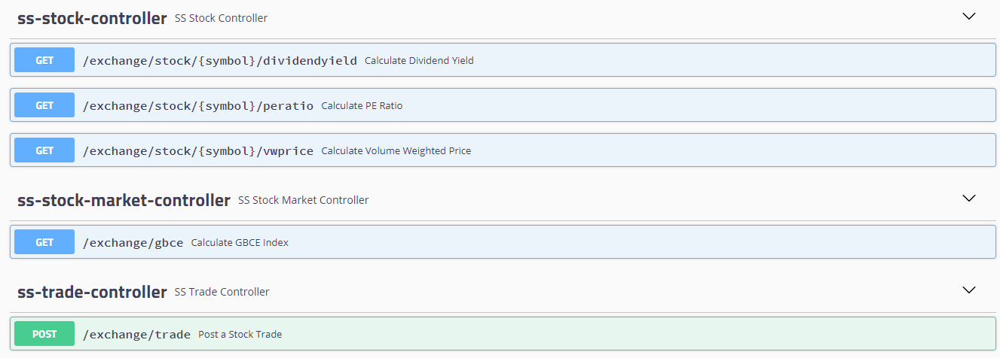

# Assignment - Super Simple Stock Market
Coding Assignment – Super Simple Stock Market

#Requirements
1. The GB Corp Exchange is a new stock market trading in drinks companies.
   1. Your company is building the object-oriented system to run that trading.
   2. You have been assigned to build part of the core object model for a limited phase 1
2. Provide the complete source code that will:-
   1. For a given stock,
      1. Given any price as input, calculate the dividend yield
      2. Given any price as input, calculate the P/E Ratio
      3. Record a trade, with timestamp, quantity, buy or sell indicator and price
      4. Calculate Volume Weighted Stock Price based on trades in past 5 minutes
   2. Calculate the GBCE All Share Index using the geometric mean of the Volume Weighted Stock Price for all stocks

#Constraints & Notes

1. Written in one of these languages - Java, C#, C++, Python, Scala
2. The source code should be suitable for forming part of the object model of a production application, and can be proven to meet the requirements. A shell script is not an appropriate submission for this assignment.
3. No database, GUI or I/O is required, all data need only be held in memory
4. No prior knowledge of stock markets or trading is required – all formulas are provided below.
5. The code should provide only the functionality requested, however it must be production quality.

#Table1. Sample data from the GBC Exchange

#Table2. Formula

#Project Details
1. It uses Java, Spring and Spring Boot tech stack. 
2. It is a Server App running on port 8080, having the REST APIs for the required 5 functions given in requirements
3. It is integrated with Swagger which enables the User to run the APIs from browser
4. Sample data from the GBCE is Added via the application.properties

#Usage Guidelines:
####This is a maven project, please run below commands:
1. mvn test -> to execute the unit tests.
2. mvn clean install -> to build the project.
3. mvn package -> to generate the executable jar.

####To run the program:
1. java -jar sssm-0.1.0.jar

####To run the REST APIs:
1. After the Server is started by the above command. Please open http://localhost:8080/swagger-ui.html# on browser
2. Now we can run the APIs by filling appropriate values needed for the APIs:
   

####Code Details
1. Controller Classes
   1. StockMarketController -> Controller for Calculating GBCE API
   2. StockController -> Controller for Calculating Dividend Yield, PE Ratio, Vol Weighted  values for given Stock
   3. TradeController -> Controller for Adding Trades